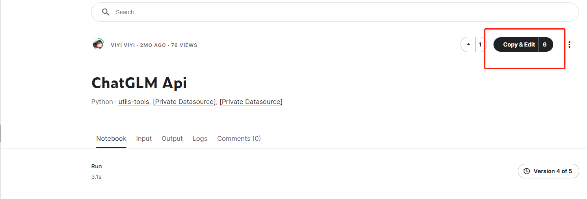
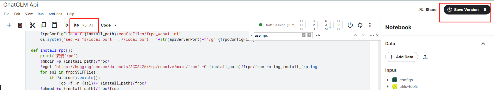
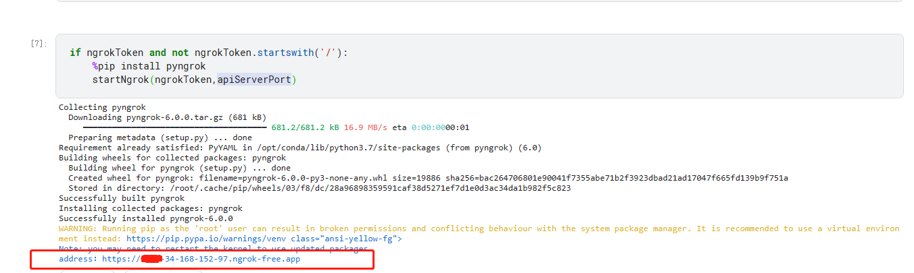
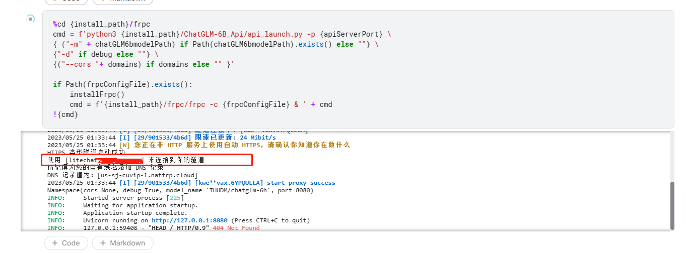
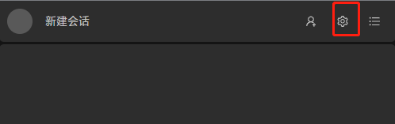
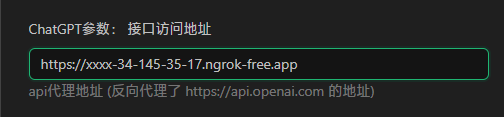

## 部署流程
这是一个在kaggle部署的简单图文流程，仅供参考。

### 1. 复制部署笔记本
kaggle注册自行解决
打开网址：[https://www.kaggle.com/code/viyiviyi/chatglm-api](https://www.kaggle.com/code/viyiviyi/chatglm-api)
点击Copy&Edit复制一份笔记。

### 2. 启动笔记
使用Run All的方式运行一段时间后会自行关闭 ，使用Save version的方式运行12小时后关闭
（记得打开右边配置的运行网络和GPU，GPU需要选择P100）

### 3. 查看 ngrok访问地址和frp地址
可以配置ngrok或frp作为穿透，需要配置其中一个，要不然也没法访问kaggle上面的应用

### 4. 等待完成就可以使用了，调用方式和ChatGPT3的调用方式相同，但内部处理逻辑不一致，很多参数是无效的
- 可以使用下面这个项目配置ngrok的地址后测试
- [https://github.com/viyiviyi/ChatGpt-lite-chat-web](https://github.com/viyiviyi/ChatGpt-lite-chat-web) 直接访问地址[https://litechat.22733.site/](https://litechat.22733.site/)
- 在设置里面把ngrok的地址填到ChatGPT的代理地址去就可以体验了

